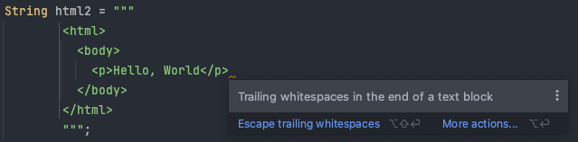

# Information session Java 12-17

## Introduction

Main topics:

- Text blocks
- Switch expressions
- Records
- Pattern matching on `instanceof`
- Sealed classes

## Release schedule

| JDK | General Availability | Link                                      |
|:---:| --------------------:| ----------------------------------------- |
| 12  |           2019/03/19 | https://openjdk.java.net/projects/jdk/12/ |
| 13  |           2019/09/17 | https://openjdk.java.net/projects/jdk/13/ |
| 14  |           2020/03/17 | https://openjdk.java.net/projects/jdk/14/ |
| 15  |           2020/09/15 | https://openjdk.java.net/projects/jdk/15/ |
| 16  |           2021/03/16 | https://openjdk.java.net/projects/jdk/16/ |
| 17  |           2021/09/14 | https://openjdk.java.net/projects/jdk/17/ |

## Migration

https://docs.oracle.com/en/java/javase/16/migrate/

## Features list

| Feature                                                      | JDK | JEP |
| ------------------------------------------------------------ | --- | --- |
| Abortable Mixed Collections for G1                           | 12  | 344 |
| Alpine Linux Port                                            | 16  | 386 |
| Default CDS Archives                                         | 12  | 341 |
| Deprecate RMI Activation for Removal                         | 15  | 385 |
| Deprecate the Applet API for Removal                         | 17* | 398 |
| Deprecate the ParallelScavenge + SerialOld GC Combination    | 14  | 366 |
| Deprecate the Solaris and SPARC Ports                        | 14  | 362 |
| Disable and Deprecate Biased Locking                         | 15  | 374 |
| Dynamic CDS Archives                                         | 13  | 350 |
| Edwards-Curve Digital Signature Algorithm (EdDSA)            | 15  | 339 |
| Elastic Metaspace                                            | 16  | 387 |
| Enable C++14 Language Features                               | 16  | 347 |
| Enhanced Pseudo-Random Number Generators                     | 17* | 356 |
| Foreign Function & Memory API (Incubator)                    | 17  | 412 |
| Foreign Linker API (Incubator)                               | 16  | 389 |
| Foreign-Memory Access API (Incubator)                        | 14  | 370 |
| Foreign-Memory Access API (Second Incubator)                 | 15  | 383 |
| Foreign-Memory Access API (Third Incubator)                  | 16  | 393 |
| Helpful `NullPointerExceptions`                              | 14  | 358 |
| Hidden Classes                                               | 15  | 371 |
| JFR Event Streaming                                          | 14  | 349 |
| JVM Constants API                                            | 12  | 334 |
| macOS/AArch64 Port                                           | 17* | 391 |
| Microbenchmark Suite                                         | 12  | 230 |
| Migrate from Mercurial to Git                                | 16  | 357 |
| Migrate to GitHub                                            | 16  | 369 |
| New macOS Rendering Pipeline                                 | 17* | 382 |
| Non-Volatile Mapped Byte Buffers                             | 14  | 352 |
| NUMA-Aware Memory Allocation for G1                          | 14  | 345 |
| One AArch64 Port, Not Two                                    | 12  | 340 |
| Packaging Tool                                               | 16  | 392 |
| Packaging Tool (Incubator)                                   | 14  | 343 |
| Pattern Matching for `instanceof`                            | 16  | 394 |
| Pattern Matching for `instanceof` (Preview)                  | 14  | 305 |
| Pattern Matching for `instanceof` (Second Preview)           | 15  | 375 |
| Promptly Return Unused Committed Memory from G1              | 12  | 346 |
| Re-implement the Legacy `DatagramSocket` API                 | 15  | 373 |
| Re-implement the Legacy `Socket` API                         | 13  | 353 |
| Records                                                      | 16  | 395 |
| Records (Preview)                                            | 14  | 359 |
| Records (Second Preview)                                     | 15  | 384 |
| Remove the Concurrent Mark Sweep (CMS) Garbage Collector     | 14  | 363 |
| Remove the Experimental AOT and JIT Compiler                 | 17* | 410 |
| Remove the Nashorn JavaScript Engine                         | 15  | 372 |
| Remove the Pack200 Tools and API                             | 14  | 367 |
| Remove the Solaris and SPARC Ports                           | 15  | 381 |
| Sealed Classes                                               | 17* | 409 |
| Sealed Classes (Preview)                                     | 15  | 360 |
| Sealed Classes (Second Preview)                              | 16  | 397 |
| Shenandoah A Low-Pause-Time Garbage Collector                | 15  | 379 |
| Shenandoah A Low-Pause-Time Garbage Collector (Experimental) | 12  | 189 |
| Strongly Encapsulate JDK Internals by Default                | 16  | 396 |
| Switch Expressions (Preview)                                 | 12  | 325 |
| Switch Expressions (Preview)                                 | 13  | 354 |
| Switch Expressions (Standard)                                | 14  | 361 |
| Text Blocks                                                  | 15  | 378 |
| Text Blocks (Preview)                                        | 13  | 355 |
| Text Blocks (Second Preview)                                 | 14  | 368 |
| Unix-Domain Socket Channels                                  | 16  | 380 |
| Vector API (Incubator)                                       | 16  | 338 |
| Vector API (Second Incubator)                                | 17  | 414 |
| Warnings for Value-Based Classes                             | 16  | 390 |
| Windows/AArch64 Port                                         | 16  | 388 |
| ZGC A Scalable Low-Latency Garbage Collector                 | 15  | 377 |
| ZGC Concurrent Thread-Stack Processing                       | 16  | 376 |
| ZGC on macOS                                                 | 14  | 364 |
| ZGC on Windows                                               | 14  | 365 |
| ZGC Uncommit Unused Memory                                   | 13  | 351 |

## Features

### Text Blocks

Add text blocks to the Java language. A text block is a multi-line string literal that avoids the need for most escape sequences, automatically formats the string in a predictable way, and gives the developer control over the format when desired.

Text blocks do not directly support string interpolation.

#### HTML example

String literal

```java
String html1 = "<html>\n" +
               "  <body>\n" +
               "    <p>Hello, World</p>\n" +
               "  </body>\n" +
               "</html>\n";
```

Text block

```java
String html2 = """
        <html>
          <body>
            <p>Hello, World</p>
          </body>
        </html>
        """;
```

#### SQL example

String literal

```java
String query1 = "SELECT \"EMP_ID\", \"LAST_NAME\" FROM \"EMPLOYEE_TB\"\n" +
                "WHERE \"CITY\" = 'INDIANAPOLIS'\n" +
                "ORDER BY \"EMP_ID\", \"LAST_NAME\";\n";
```

Text block

```java
String query2 = """
         SELECT "EMP_ID", "LAST_NAME" FROM "EMPLOYEE_TB"
         WHERE "CITY" = 'INDIANAPOLIS'
         ORDER BY "EMP_ID", "LAST_NAME";
         """;
```

#### Additional notes

A text block is processed by the Java compiler in three distinct steps:

1. Line terminators in the content are translated to LF (\u000A). The purpose of this translation is to follow the principle of least surprise when moving Java source code across platforms.
2. Incidental white space surrounding the content, introduced to match the indentation of Java source code, is removed.
3. Escape sequences in the content are interpreted. Performing interpretation as the final step means developers can write escape sequences such as \n without them being modified or deleted by earlier steps.

Trailing white space is most often unintentional, idiosyncratic, and insignificant. The Java compiler processes the content by removing incidental white space to yield what the developer intended.



The following methods support text blocks:

- `String::stripIndent()`: used to strip away incidental white space from the text block content
- `String::translateEscapes()`: used to translate escape sequences
- `String::formatted(Object... args)`: simplify value substitution in the text block

### Switch Expressions

Aimed to fix several irregularities of the existing switch statement. These include the default control flow behavior between switch labels (fall through), the default scoping in switch blocks (the whole block is treated as one scope), and the fact that switch works only as a statement, even though it is often more natural to express multi-way conditionals as expressions.

Switch statement

```java
private static int getPriorityOf1(Rank rank) {
    switch (rank) {
       case DEUCE, TREY, FOUR, FIVE:
          /* falls through */
          LOGGER.info("Hello there");
       case SIX:
          return -1;
       case SEVEN, EIGHT, NINE:
          int temp = doSomething(rank); // block scope
          LOGGER.info(() -> "Some message: %d".formatted(temp));
          return temp;
       case TEN, JACK, QUEEN:
          // int temp = 3; // compilation error - variable already defined
       case KING, ACE:
          return 1;
       default: // required...?
          throw new IllegalStateException("Unexpected value: " + rank);
    }
 }
```

Switch expression

```java
private static int getPriorityOf2(Rank rank) {
    return switch (rank) {
       case DEUCE, TREY, FOUR, FIVE -> {
          LOGGER.info("Hello there");
          yield -1;
       }
       case SIX -> -1;
       case SEVEN, EIGHT, NINE -> {
          int temp = doSomething(rank);
          LOGGER.info(() -> "Some message: %d".formatted(temp));
          yield temp;
       }
       case TEN, JACK, QUEEN -> {
          int temp = 3; // scoped as expected
          LOGGER.info(() -> "Some message: %d".formatted(temp));
          yield 1;
       }
       case KING, ACE -> 1;
    };
 }
```

Note: The switch expression must cover all possible input values. A `java.lang.NullPointerException` is thrown when `null` is passed.

### Records

Enhances the Java programming language with records, which are classes that act as transparent carriers for immutable data. Records can be thought of as nominal tuples.

Goals

- modeling immutable data rather than extensible behavior
- Automatically implement data-driven methods such as equals and accessors.

Non-Goals

- does not replace JavaBeans
- does not replace libraries like Lombok

Classic POJO

```java
public class Point {
    private final int x;
    private final int y;

    public Point(int x, int y) {
        this.x = x;
        this.y = y;
    }

    int getX() { return x; }
    int getY() { return y; }

    public boolean equals(Object o) {
        if (!(o instanceof Point)) return false;
        Point other = (Point) o;
        return other.x == x && other.y == y;
    }

    public int hashCode() {
        return Objects.hash(x, y);
    }

    public String toString() {
        return String.format("Point[x=%d, y=%d]", x, y);
    }
}
```

Record type

```java
record Point(int x, int y) { }

Point r = new Point(1, 1);
LOGGER.info(r::toString);
LOGGER.info(() -> "(x:%d, y:%d)".formatted(
        r.x(), r.y()));
```

#### Rules for record classes

- A record class declaration does not have an extends clause.
- A record class is implicitly final, and cannot be abstract.
- The fields derived from the record components are final.
- other...

#### Additional notes on records

Local record classes

```java
private static void printCards() {
  record Card(Rank rank, Suit suit) {}

  List<Card> cards = new ArrayList<>();
  for (Rank rank : Rank.values()) {
     for (Suit suit : Suit.values()) {
        cards.add(new Card(rank, suit));
     }
  }
  
  LOGGER.info(() -> "Cards: " + cards);
}
```

### Pattern matching on `instanceof`

Enhance the Java programming language with pattern matching for the `instanceof` operator.

Without pattern matching

```java
private static void patternMatching1(Shape shape) {
  if (shape instanceof Circle) {
     Circle circle = ((Circle) shape);
     action(circle);
  } else if (shape instanceof Rectangle) {
     Rectangle rectangle = ((Rectangle) shape);
     if (rectangle.getArea() > 0) {
        action(rectangle);
     }
  } else {
     LOGGER.info("no match... %s".formatted(shape));
  }
}
```

With pattern matching

```java
private static void patternMatching2(Shape shape) {
  if (shape instanceof Circle circle) {
     action(circle);
  } else if (shape instanceof Rectangle rectangle && rectangle.getArea() > 0) {
     action(rectangle);
  } else {
     LOGGER.info("no match... %s".formatted(shape));
  }
}
```

### Sealed classes

Sealed classes and interfaces restrict which other classes or interfaces may extend or implement them. Sealed types allow you to expose a type (interface or class) to other code while still keeping full control of subtypes, and they also allow you to keep abstract classes completely private.

Essentially it makes it possible for a superclass to be widely _accessible_ but not widely _extensible_.

#### Constraints imposed on subclasses

A sealed class imposes three constraints on its permitted subclasses:

1. The sealed class and its permitted subclasses must belong to the same module, and, if declared in an unnamed module, to the same package.
2. Every permitted subclass must directly extend the sealed class.
3. Every permitted subclass must use a modifier to describe how it propagates the sealing initiated by its superclass:
   - A permitted subclass may be declared final to prevent its part of the class hierarchy from being extended further.
   - A permitted subclass may be declared sealed to allow its part of the hierarchy to be extended further than envisaged by its sealed superclass, but in a restricted fashion.
   - A permitted subclass may be declared non-sealed so that its part of the hierarchy reverts to being open for extension by unknown subclasses. (A sealed class cannot prevent its permitted subclasses from doing this.)

```java
// shapes
public abstract sealed class Shape permits Circle, Rectangle, Square { }

//// circles
public final class Circle extends Shape { }

//// rectangles
public sealed class Rectangle extends Shape permits TransparentRectangle, FilledRectangle { }

public final class TransparentRectangle extends Rectangle { }

public final class FilledRectangle extends Rectangle { }

//// squares
public non-sealed class Square extends Shape { }
```

#### Additional notes on sealed classes

- Exactly one of the modifiers final, sealed, and non-sealed must be used by each permitted subclass. It is not possible for a class to be:
  - both sealed (implying subclasses) and final (implying no subclasses), or
  - both non-sealed (implying subclasses) and final (implying no subclasses), or
  - both sealed (implying restricted subclasses) and non-sealed (implying unrestricted subclasses)
- Similar to classes, an interface can be sealed by applying the sealed modifier to the interface. 
- Sealed classes work well with record classes (JEP 395). Record classes are implicitly final, so a sealed hierarchy of record classes is slightly more concise.

#### Future release - sealed classes and pattern matching

A significant benefit of sealed classes will be realized in a future release in conjunction with pattern matching. Instead of inspecting an instance of a sealed class with if-else chains, user code will be able to use a switch enhanced with type test patterns.

```java
Shape rotate(Shape shape, double angle) {
    if (shape instanceof Circle) return shape;
    else if (shape instanceof Rectangle) return shape.rotate(angle);
    else if (shape instanceof Square) return shape.rotate(angle);
    // no else needed!
}
```

Pattern-matching switch

```java
Shape rotate(Shape shape, double angle) {
    return switch (shape) {   // pattern matching switch
        case Circle c    -> c; 
        case Rectangle r -> r.rotate(angle);
        case Square s    -> s.rotate(angle);
        // no default needed!
    }
}
```

### Extras

#### Shorter number representation given a locale

`CompactNumberFormat` is designed to represent a number in a shorter form, based on the patterns provided by a given locale.

```java
// java.text.NumberFormat.java
public static NumberFormat getCompactNumberInstance(Locale locale, NumberFormat.Style formatStyle);
```

```java
NumberFormat likesShort = NumberFormat.getCompactNumberInstance(LOCALE, NumberFormat.Style.SHORT);
likesShort.setMaximumFractionDigits(2);
likesShort.format(2592)
// Locale.US            --> 2.59K
// Locale.CANADA_FRENCH --> 2,59 k
  
NumberFormat likesLong = NumberFormat.getCompactNumberInstance(LOCALE, NumberFormat.Style.LONG);
likesLong.setMaximumFractionDigits(2);
likesLong.format(2592)
// Locale.US            --> 2.59 thousand
// Locale.CANADA_FRENCH --> 2,59 mille

```

#### Helpful `NullPointerExceptions`

Improves the usability of `NullPointerExceptions` generated by the JVM by describing precisely which variable was null.

```java
package info;

import java.util.Locale;

public class HelpfulNullPointerExceptions {

   public static void main(String[] args) {
      String input = null;
      String result = showUpperCase(input); // NullPointerException
   }

   public static String showUpperCase(String str) {
      return str.toUpperCase(Locale.US);
   }
}
```

Before JDK14

```java
Exception in thread "main" java.lang.NullPointerException
 at info.HelpfulNullPointerExceptions.showUpperCase(HelpfulNullPointerExceptions.java:13)
 at info.HelpfulNullPointerExceptions.main(HelpfulNullPointerExceptions.java:9)
```

After JDK14

```java
Exception in thread "main" java.lang.NullPointerException: Cannot invoke "String.toUpperCase(java.util.Locale)" because "str" is null
  at info.HelpfulNullPointerExceptions.showUpperCase(HelpfulNullPointerExceptions.java:13)
  at info.HelpfulNullPointerExceptions.main(HelpfulNullPointerExceptions.java:9)
```

### Future features

- value inline classes
- generic specialization

#### Inline Types

https://wiki.openjdk.java.net/display/valhalla/L-World

- Inline Types are small, immutable, identity-less types
- User model: "codes like a class, works like an int"
- Use cases: Numerics, algebraic data types, tuples, cursors, ...

Removing identity commitment enables optimizations such as

- flattening of inline types in containers such as fields or arrays
- reducing cost of indirection and locality of reference with attendant cache miss penalties
- reducing memory footprint and load on garbage collectors

#### Specialization

https://cr.openjdk.java.net/~briangoetz/valhalla/specialization.html

- Generic specialization

```java
List<int>
```

- Reified generics?

Making actual types available at runtime

```java
// might be possible?
public static int sum(List<int> xs) {...}       // does not compile because
public static double sum(List<double> xs) {...} // of type erasure
```

### References

- Some code examples https://github.com/m-orfanos/info-session-jdk-12-17-features/
- oracle migration guide https://docs.oracle.com/en/java/javase/16/migrate/
- openjdk releases
  - https://openjdk.java.net/projects/jdk/12/
  - https://openjdk.java.net/projects/jdk/13/
  - https://openjdk.java.net/projects/jdk/14/
  - https://openjdk.java.net/projects/jdk/15/
  - https://openjdk.java.net/projects/jdk/16/
  - https://openjdk.java.net/projects/jdk/17/
- Articles
  - https://www.baeldung.com/java-12-new-features
  - https://www.baeldung.com/java-13-new-features
  - https://www.baeldung.com/java-14-new-features
  - https://www.baeldung.com/java-15-new
  - https://mkyong.com/java/what-is-new-in-java-12/
  - https://mkyong.com/java/what-is-new-in-java-13/
  - https://mkyong.com/java/what-is-new-in-java-14/
  - https://mkyong.com/java/what-is-new-in-java-15/
  - https://mkyong.com/java/what-is-new-in-java-16/
